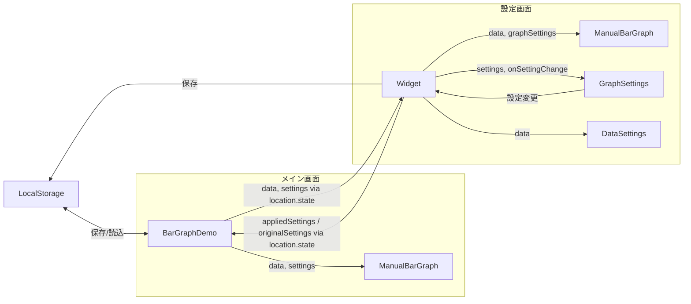

## データフロー
2025/04/05 更新

```mermaid
flowchart LR
    LocalStorage <--"保存/読込"--> BarGraphDemo
    subgraph メイン画面
        BarGraphDemo --"data, settings"--> ManualBarGraph
    end
    
    subgraph 設定画面
        Widget --"data, graphSettings"--> ManualBarGraph2[ManualBarGraph]
        Widget --"settings, onSettingChange"--> GraphSettings
        Widget --"data"--> DataSettings
    end
    
    BarGraphDemo --"data, settings via location.state"--> Widget
    Widget --"appliedSettings / originalSettings via location.state"--> BarGraphDemo
    
    GraphSettings --"設定変更"--> Widget
    Widget --"保存"--> LocalStorage
```
