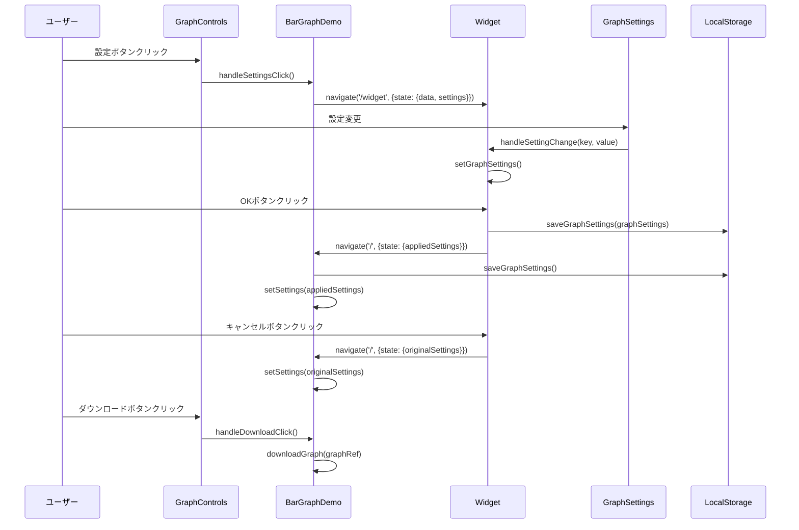

## イベントフロー
2025/04/05 更新

```mermaid
sequenceDiagram
    participant User as ユーザー
    participant GC as GraphControls
    participant BGD as BarGraphDemo
    participant WG as Widget
    participant GS as GraphSettings
    participant LS as LocalStorage
    
    %% 設定画面表示
    User->>GC: 設定ボタンクリック
    GC->>BGD: handleSettingsClick()
    BGD->>WG: navigate('/widget', {state: {data, settings}})
    
    %% 設定変更
    User->>GS: 設定変更
    GS->>WG: handleSettingChange(key, value)
    WG->>WG: setGraphSettings()
    
    %% 設定適用
    User->>WG: OKボタンクリック
    WG->>LS: saveGraphSettings(graphSettings)
    WG->>BGD: navigate('/', {state: {appliedSettings}})
    BGD->>LS: saveGraphSettings()
    BGD->>BGD: setSettings(appliedSettings)
    
    %% 設定キャンセル
    User->>WG: キャンセルボタンクリック
    WG->>BGD: navigate('/', {state: {originalSettings}})
    BGD->>BGD: setSettings(originalSettings)
    
    %% グラフダウンロード
    User->>GC: ダウンロードボタンクリック
    GC->>BGD: handleDownloadClick()
    BGD->>BGD: downloadGraph(graphRef)
```
